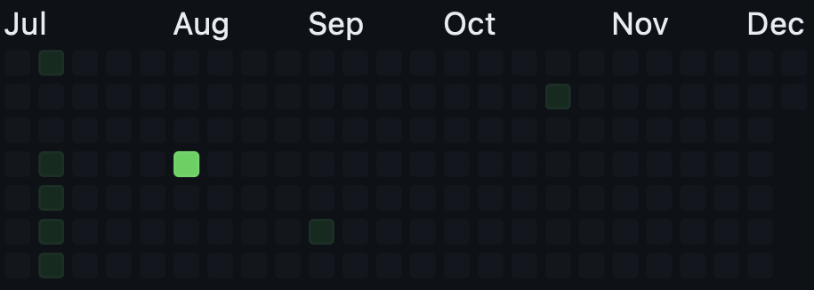

# Github scraper
This script is getting all commits every 24h and will push via mqtt the commits to an Awtrix Light display. In my case a Ulanzi TC001.
Today will be displayed with a white Pixel

## Features
- [x] Get commits from user via git rest api
  - [x] Api will only forced once a day, to go easy on the api calls
- [x] creates bitmap for display
- [x] sends bitmap to ulanzi via mqtt
- [x] Today will be displayed with a white pixel
- [x] Display matrix icon as eye cather 
- [x] Diffenrent brightness for different commits depending on amount
- [x] display different months with indicators
- [ ] Add issues to graph. Otherwise pixel will miss on Awrtix

## What to do
1. You need to rename the config_smaple.py to config.py
2. Fill in necessarry information
3. Have fun

 ## Display vs Github                 
Display
 
Github 
 